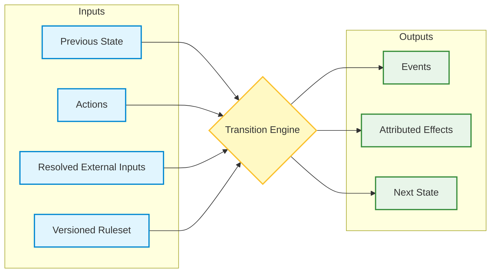

*How a health-policy strategy game became an experiment in institutional response, incomplete information, and reproducible simulation design.*


---

## The Business Game I Could Not Quite Rebuild

One of the management games that stayed with me was *Capitalism*. It let me build factories, open stores, set prices, and watch competitors move around a simulated economy. The part that stayed with me was the way a decision rarely ended where I made it.

A product that looked profitable on one screen could become a problem several turns later. A price cut might protect market share while weakening margins. A capacity decision could leave inventory stranded. A competitor could respond faster than I expected. The game made management feel like an attempt to understand a system that kept answering back.

That kind of feedback is satisfying because it gives the player a legible loop: act, observe, revise, and eventually learn why the model behaves the way it does. I wanted to recover some of that feeling in a health-system setting, but the analogy began to break almost immediately.

A conventional business simulation can often treat the firm as a fairly coherent decision-maker. The objective may be simplified, but the simplification is at least recognizable: grow, earn profit, preserve cash, beat competitors, allocate capital better than the market. Healthcare makes that frame unstable. A nonprofit health system can improve its margin by doing something that damages access. A payer can lower medical spending while increasing provider instability. A regulator can announce a sensible policy and then watch the implementation change as organizations bargain, delay, reinterpret, or route around it.

Consider a regional hospital deciding whether to close a financially weak service line. On a business dashboard, the case may look clean. The service loses money, consumes staff, and distracts from more profitable outpatient growth. In the surrounding health-policy system, the same action changes local access, emergency department flows, competitor positioning, payer network leverage, workforce morale, community trust, and political attention. The decision is still managerial, but the result is institutional.

That difference became the starting point for the Health Policy Strategy Game. The project needed to be more than a hospital-themed business simulator. It needed a market, a regulator, a payer, a workforce, and a community with enough structure to respond.

---

## Healthcare Turns Management Into Institutional Strategy

Health systems operate inside a dense set of payment rules, professional norms, public obligations, political relationships, labor markets, and measurement systems. Treating them as ordinary firms with a few extra constraints misses how many lenses are applied to the same decision.

A chief executive may care about operating margin, bond ratings, staffing, payer contracts, quality scores, access, community legitimacy, and regulatory standing. Those goals pull in different directions, and other actors carry their own authority and incentives: insurers, state officials, labor groups, rival systems, employers, clinicians, and advocacy coalitions.

Microeconomics gives part of the vocabulary: market power, bargaining, information asymmetry, externalities, principal-agent problems, cross-subsidization, and public goods. Health-services research adds the institutional messiness: administered prices, negotiated payment, fragmented authority, delayed measurement, heterogeneous organizations, and implementation that changes as policy moves through real institutions.

The game tries to make that combination playable. In the current public prototype, the player leads a fictional nonprofit US health system through financial pressure, workforce constraints, payer negotiations, policy oversight, market competition, and community trust. The two current campaigns are intentionally bounded. `stabilization-v1` is a five-turn executive stabilization campaign. `competitive-regional-v1` is a three-month preview of a regional competitive market with a human-led system, AI rival systems, simultaneous monthly actions, lagged rival observability, and an end-of-run debrief.

The small scope matters. The current version is a playable prototype for testing whether a particular kind of management problem can be represented coherently: decisions whose consequences depend on how other institutions respond. Calibration, hospital operations fidelity, and forecasting authority belong to later validation work.

That framing also keeps the article from becoming a feature tour. The presence of a payer, a regulator, or a rival system matters because those actors change what the player has to reason about. A finance-only game can ask whether a capital investment pays for itself. A health-policy strategy game should also ask who loses access while the investment matures, whether staff can absorb the change, whether the public explanation is credible, and whether a competitor uses the same window to strengthen its own position.

---

## Policy Changes Behavior Before It Changes Outcomes

The central design claim is that health-policy outcomes are mediated by behavior. A reimbursement change, an access pledge, a capital project, or a contract posture changes the strategic situation faced by other actors before it changes the outcome the designer hoped to influence.

If a payer tightens rates, a health system may reduce discretionary investment, seek consolidation, bargain more aggressively, shift attention toward commercially insured patients, or lean on political relationships. If a state official raises access scrutiny, a nonprofit system may make a public pledge, delay a closure, expand a clinic, or invest just enough to protect legitimacy. If a rival adds beds, the player may respond with recruitment, monitoring, outpatient investment, or payer negotiation.

This is why non-player institutions need more structure than atmospheric variables. They need objectives, authority, information, constraints, and decision procedures. The commercial insurer needs a bargaining posture. The state-policy actor needs a reason to apply pressure or back off. A rival health system needs a strategy that affects market share through recognizable choices.

The project can use game theory without requiring every actor to run a formal equilibrium solver. The useful level for the first playable slices is local and inspectable: bargaining posture, coalition pressure, rival style, monitoring, delayed effects, and bounded responses to visible conditions. The implementation has to show institutional response in the mechanics rather than explain it after the fact on a results screen.

The competitive preview makes this more tangible. A player can submit commands such as:

```text
monitor target=northlake depth=1; recruit role=nurse headcount=4
```

or:

```text
project kind=clinic_network budget=18; negotiate payer=carrier_a rate_posture=neutral
```

Those commands are small, but they carry several kinds of consequence. Monitoring consumes action capacity now to reduce uncertainty later. Recruiting addresses access and staffing pressure while consuming cash and creating timing costs. A clinic network project can improve long-run capacity but draws cash over time. A payer negotiation may help revenue, but it occurs in a market where rival moves and policy scrutiny matter.

The game becomes interesting when these choices interact. A command that simply adjusts one visible score would make the health-policy setting cosmetic. The design goal is for a player to feel that every action is also a signal, a resource allocation, a political move, and a bet about what other actors will do next.

In one recent competitive playtest profile, the agent opened with a clinic network project and nurse recruitment. That produced a recognizable tradeoff. The project and recruitment addressed access and capacity, but they consumed cash and left workforce trust strained while benefits arrived over time. The next month, the player made an access pledge and monitored Northlake, revealing a rival bed investment that had not been visible at the start. By the third month, the player used a neutral payer negotiation while managing a tighter cash position.

That is a small run, and it should be treated as a small run. Its value is that the causal path was legible. The player could point to the project, the recruitment spend, the monitoring decision, the rival action, and the payer context. A three-month preview is an early balance signal with limited authority; it can still show whether the core loop creates decisions that are worth discussing.

---

## The Player Should Not See The Whole System

Many management games give the player an almost omniscient view. The numbers may be complex, but the dashboard usually implies that the player sees the relevant truth. Healthcare is rarely that convenient.

Reported access may lag true access. Quality signals may move slowly. Rival activity may be public, private, or visible only after monitoring. State officials may react to public indicators that do not perfectly match underlying conditions. A player can make a reasonable choice and still be punished by a delayed measurement, a rival move, or an exogenous shock.

The Health Policy Strategy Game therefore separates true state from actor-visible observation. The implementation records a simulated world, while the player sees reports, briefings, rival intelligence, and delayed or noisy measurements. Non-player actors make their own decisions from their own visible information. Later corrections appear as later information instead of rewriting what a player previously knew.

There is a technical boundary inside that sentence that deserves to be stated plainly. In the current competitive preview, rival AI systems use observation snapshots rather than a rich posterior belief state over the whole market. They receive their own visible metrics, shared market fields, resources, lagged public rival actions, and explicit intelligence gaps. Their decisions are bounded and inspectable. The current model generates candidate commands, scores them with style weights, responds to visible rival moves, applies a satisficing margin, and records a rationale. That is closer to level-1 best response over observed signals than to a full Bayesian game.

That boundary is a feature of the prototype stage. It lets the project test whether partial observability, rival pressure, and debriefable rationales are useful before adding a formal belief-state model. The harder epistemic-game-theory problem is still there: several partially observing institutions act, reveal information, hide information, and change each other's future observations. The current implementation gives that problem a narrow playable surface rather than pretending it has already solved the general case.

This distinction matters for education. A game that evaluates final outcomes alone teaches hindsight. If access falls after a decision, the player can always be told that the decision was bad. Executive reasoning has to handle messier cases: a good decision can receive an unfavorable realization, a weak decision can benefit from luck, a rival can move outside the player's view, and a measurement can arrive late.

The more useful question is whether the decision was reasonable given the information available at the time. Did the player recognize that cash runway was tight? Did they understand that a rival had not yet been monitored? Did they spend political capital in a month when policy attention made it valuable? Did they overreact to one noisy signal? Did they preserve enough flexibility for a delayed project?

This is why the debrief is part of the product rather than an afterthought. A scoreboard can report where the system ended. A debrief from committed history can ask what the player knew, what other actors did, which effects were delayed, and which mechanisms produced the outcome.

---

## A Rational Actor Can Produce A Socially Bad Result

One of the easiest mistakes in a policy simulation is to hide every value conflict inside a single master score. That makes the interface tidy and the model less honest.

In healthcare, organizational success and social welfare often diverge. A hospital may protect its margin by reducing unprofitable access. A payer may reduce costs while making a safety-net provider less stable. A regulator may pursue affordability in a way that creates new capacity problems. A rival system may expand profitable services while leaving less visible community needs unmet.

The game treats those conflicts as first-class design material. The player can pursue financial stabilization, access improvement, workforce investment, payer leverage, capital projects, or political legitimacy. Several strategies should be defensible under different goals and beliefs, with tradeoffs that remain visible rather than being washed into one rating.

The competitive scenario brief captures this tension directly. The player leads Riverside Community Health, a safety-net-leaning system in a fictional regional market. Rival systems have different strategies and constraints. Market share matters, but the player also has to balance access, workforce stability, trust, and policy legitimacy.

This separation changes how the game should be read. If the player improves cash while access stagnates, the simulation may be exposing a real conflict. If an access-heavy strategy improves community trust while draining cash, the debrief should preserve both sides of that result so the player can argue about the strategy rather than accept a score as the whole judgment.

That is the practical reason for keeping actor rationality, player interest, social welfare, and educational assessment distinct. Coordination failure, cost shifting, market power, and public goods become visible when the model gives different actors different objective functions.

---

## An Uncertain World Needs A Deterministic Core

The most important engineering decision in the project is also a modeling decision. The simulated world can be uncertain, but the core transition should be deterministic.

The intended shape is:



The transition core receives all varying inputs explicitly. Randomness, wall-clock time, filesystem state, network state, terminal input, and global mutable state stay outside that core path. Randomness enters before the transition as resolved inputs: measurement noise, delayed access reporting, labor pressure, policy signals, coalition leverage, competitor signals, and other seeded streams. Once those values are resolved, the transition function receives them like any other input.

That design may sound fussy for a game prototype, but it solves a real problem. When an unexpected outcome appears, I want to ask where it came from. Was it the player's command? A rival response? A delayed project? A policy signal? A measurement revision? A stochastic input? If random draws are hidden inside state mutation, that question becomes much harder to answer.

Determinism also supports replay. The project records append-only history and stable state hashes for committed transitions. The hash is a deterministic regression check with a modest purpose: given the same prior state, commands, resolved inputs, and ruleset, did the simulation produce the same next state?

That guarantee is mechanical. A stable hash can tell me that the transition path reproduced. Empirical calibration, behavioral validity, classroom learning, and adversarial tamper resistance live outside that guarantee. Deterministic and hashed can sound stronger than they are. Here they mean reproducible enough to debug and argue about.

That matters for debugging and for instruction. A classroom or playtest debrief should be able to reconstruct the causal path from the run itself. If a payer negotiation failed, that should be distinguishable from an invalid command. If a project produced delayed benefits, the queue and committed effects should show that timing. If a rival's action was unobserved at the time, the later debrief should preserve that information boundary.

The architecture therefore makes provenance part of the simulation. Events and effects are attributed. History is append-only. Actor rationales are recorded where relevant. Replay verification checks that the committed path remains stable. Those choices make the game easier to test as software and easier to discuss as a model.

There is a second benefit: deterministic transitions make disagreement more precise. A reviewer can challenge the mechanism, the parameter, the actor rationale, or the scenario setup against a reproducible run. If the model says that an access pledge reduced policy pressure, the debate can move to the assumption behind that effect. If a rival response looks implausible, the actor decision record can be inspected. Reproducibility gives criticism a stable object even when the underlying assumption remains contested.

---

## Rust And The CLI Followed From The Model

Rust was useful here less for raw performance than for explicit distinctions.

An invalid operation is different from a valid operation with an unfavorable result. If an actor lacks the authority or resources to issue a command, that is a validation problem. If a contract posture is legal but fails to produce the hoped-for response, that is a game outcome. Those two cases deserve separate representation rather than a generic error path.

The same principle applies across the model: commands, resolved inputs, events, effects, observations, histories, resources, and campaign types are different concepts. Rust's type system, enums, pattern matching, and ordinary module boundaries make it easier to keep those distinctions visible. The model still needs review, testing, and domain judgment, but the code has fewer places to hide ambiguous concepts.

There is a real tension here. Rust is good at closed representations: an enum says which commands exist, and exhaustive matching forces the code to handle each one. Health-policy scenarios want to grow in the opposite direction. New scenarios may need new actor types, new bargaining contexts, new policy pressures, or different institutional roles. If every new content idea required a new Rust type, the type system would become a bottleneck for scenario authors.

The design answer is to keep the closure where the model needs it and move content into data where the mechanism is already known. Core mechanics, validation rules, commands, events, effects, and replay semantics belong in typed Rust. Scenario content, parameters, actor definitions, event schedules, learning objectives, and evaluation profiles should become versioned data where practical. A future scenario author should be able to compose known mechanisms without editing the engine. A genuinely new mechanism, such as a new bargaining model or a richer belief-state representation, should still enter through code, tests, and review.

The command-line interface followed from a similar constraint. The project is CLI-first because the early product surface needs reproducible decisions, compact state summaries, inspectable logs, and commands that can be replayed or discussed. The competitive campaign uses a Stata-like grammar:

```text
verb arg=value
```

Multiple commands can be chained in a monthly batch:

```text
monitor target=northlake depth=1; recruit role=nurse headcount=4
```

The important feature is the command model rather than nostalgia for terminal software. It forces the operations to become explicit. What verbs exist? What arguments do they accept? Which failures are parse errors, validation errors, or modeled outcomes? What gets stored in replay? What belongs to presentation and what belongs to the transition core?

The project's architecture decision records preserve that boundary. CLI parsing maps strings into typed commands. Validation and simulation remain in the model and simulation layers. Replay artifacts store typed command batches rather than raw strings so future parse changes leave history stable. The terminal is an adapter over the model.

That same logic keeps a future graphical interface from becoming a separate game. A GUI could eventually make tradeoffs easier to inspect, especially for classroom use. But it should call the same command and transition boundaries. Otherwise the project would have two simulations: the one in the core and the one implied by the interface.

This is also why the CLI is a reasonable first surface for a serious game, even though a finished educational product may eventually need richer visual presentation. The terminal forces the early design to name actions and results. It makes command histories easy to copy into a playtest report. It gives automated tests and agent playtests the same semantic vocabulary that a human player sees. A polished GUI can improve orientation later, but the command model has to be right before a better screen can help much.

If you want to find more discourse on CLI-first design, please check out [this blog post](https://medium.com/@saehwanpark/why-i-design-cli-first-software-ef1171c023b9).

## Agent Playtests Are Evidence, But Not Authority

The project also includes a local MCP server for bounded AI-agent playtesting. This might sound like an unrelated agent feature, but it fits the same architecture.

An agent can play through the same explicit boundary. It can start a bounded session, read the current actor-visible observation, see the legal command format, submit one turn or month of commands, inspect transition summaries and state hashes, and end the session with a debrief. The MCP layer provides that surface as an adapter over existing campaign primitives. It keeps hidden true state, validation, and direct mutation behind the same boundaries used by the CLI.

That boundary is important because agent playtests are useful and easy to overstate. The current findings show that simulated agents can complete the available campaigns, use the command hints, produce observed command-pattern clusters, and explain outcomes from history and debrief text. Recent runs helped identify issues such as passive `hold` overuse and underuse of capital projects, which then informed guidance and debrief improvements.

The cluster language needs caution. In a three-month preview, two runs can look strategically different because the command surface, prompts, resource budgets, or short horizon steer agents toward a small number of sensible openings. That is still useful product evidence, but it is weaker than evidence of durable strategic diversity. A stronger claim would need longer campaigns, more seeds, varied profiles, controlled scenario comparisons, and tests that change the information surface or command affordances to see whether behavior changes for the right reasons.

Those are real signals for development. Their authority is local: command comprehension, strategy-space hints, and debrief quality. Human learning, empirical calibration, policy validity, equilibrium behavior, dominant strategies, and forecasting reliability require different evidence.

I like the agent playtest loop because it is disciplined evidence for the stage the project is actually in. It can test whether the command surface is usable by an autonomous operator. It can reveal whether the debrief contains enough committed history to support causal explanation. It can compare strategy-space behavior across seeds and profiles. It can do all of that without pretending to be human playtesting.

This distinction is worth preserving. Early prototypes often get weaker when they inflate every positive signal into validation. The better posture is to ask what kind of evidence a test can legitimately provide and then route the next design decision accordingly.

---

## What The Prototype Proves, And What It Does Not

The current Health Policy Strategy Game proves a narrower point than a finished educational product would need to prove. It shows that a health-system management game can be organized around institutional response, partial observation, deterministic replay, and causal debriefing while still remaining playable.

It also shows that the architecture can support two playable campaign shapes. The stabilization campaign provides a compact executive decision loop. The competitive preview adds simultaneous monthly actions, rival systems, resource constraints, lagged observability, and Stata-like command entry. Both remain deterministic for a given seed and set of choices. Both preserve the separation between true state, observation, transition, history, and debrief.

Empirical authority remains a later milestone. The current numerical thresholds are documented abstractions rather than calibrated estimates. The competitive campaign is a three-month preview ahead of the planned full 24-month campaign. Competitive scenario loading, replay export, autosave, and broader actor expansion remain deferred. AI-agent playtests are validation aids for gameplay and explanation; measured human learning requires human evidence.

The next serious work should therefore prioritize validation over a rush toward a universal simulation platform. Expert review can test whether mechanisms are institutionally plausible. Longer playtests can test whether strategies remain distinct beyond the preview and beyond the command surface's first-order nudges. Human sessions can test whether the game teaches the intended concepts. Sensitivity analysis can show whether conclusions depend on fragile parameters. Scenario authoring can expand where repeated evidence shows that the current narrow structures are blocking useful design.

The project began with the desire to recover something I liked in older management games: the feeling that choices interact over time inside a world that responds. Healthcare makes that response harder to model and more important to preserve. A health-system decision is rarely an internal optimization problem alone. It is a move inside a market, a political system, a workforce, a measurement regime, and a community.

That is what the game is trying to make playable. A prototype cannot settle health policy. A serious health-policy game can still make the surrounding institutions answer back.

---

## How to Download and Run

This project is available on [here](https://github.com/SaehwanPark/hs-mgt-game).

Assuming you have [Rust installed](https://www.rust-lang.org/tools/install), you can run the game locally by cloning the repo and running via `cargo`.

```bash
git clone https://github.com/SaehwanPark/hs-mgt-game
cd hs-mgt-game
cargo run
```
