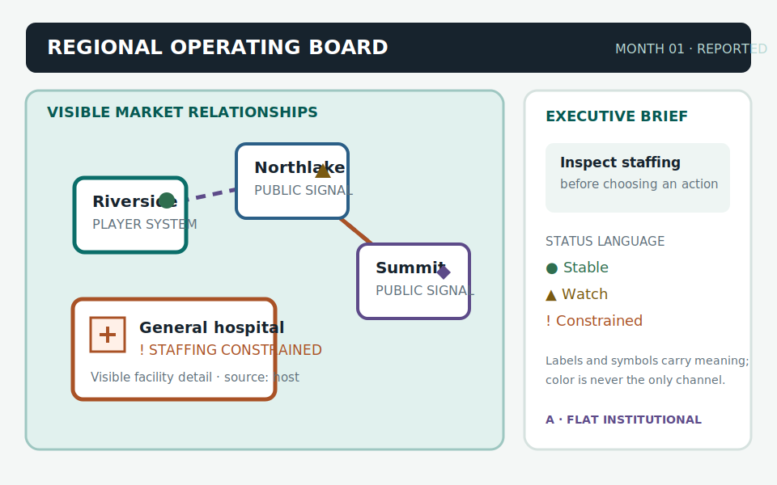
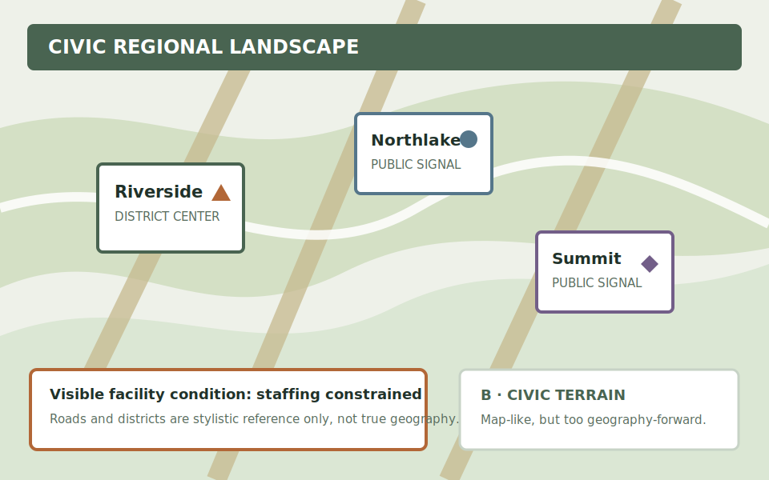
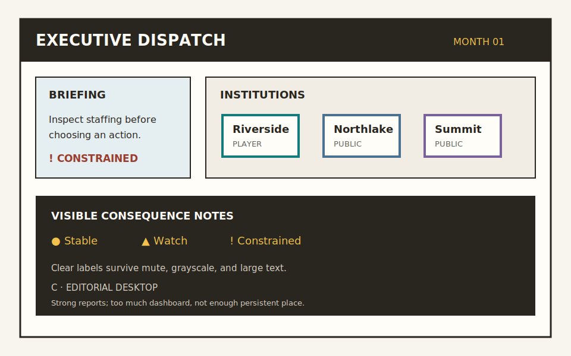

# Visual/audio art-direction reference board

**Status:** Variant A selected for the next technical rendering slice
**Version:** v0.12.35
**Evidence type:** Technical design proxy; not human design or accessibility
study

## Reference variants

### Variant A — institutional flat executive board (selected)

Flat institutional cards, a restrained oblique relationship board, visible
labels, and compact status markers. This best preserves the executive
perspective while giving facilities and institutions a stable visual home.

### Variant B — civic terrain board (rejected)

Districts, roads, and terrain bands provide a stronger regional metaphor, but
they imply geographic precision, routes, and spatial relationships that the
current host projection does not supply.

### Variant C — editorial executive desktop (rejected)

High-contrast report tiles are clear and cheap to implement, but the composition
reads as a dashboard and weakens the persistent regional/place relationship that
the roadmap asks the visual layer to make memorable.

## Scored comparison

Scores use 1–5, where 5 is strongest for this project. The score is a design
routing aid, not a measured user preference.

| Criterion | A: institutional flat | B: civic terrain | C: editorial desktop |
| --- | ---: | ---: | ---: |
| Strategic/spatial legibility | 5 | 4 | 3 |
| Semantic clarity at compact size | 5 | 3 | 4 |
| Institutional tone | 5 | 4 | 3 |
| Color-independent accessibility path | 5 | 3 | 5 |
| Reusable modular vocabulary | 5 | 3 | 4 |
| Implementation risk within current host boundary | 4 | 2 | 5 |
| **Total** | **29** | **19** | **24** |

## Review record

- Color-blind review: each variant repeats identity/status meaning with text and
  shapes; A is preferred because labels remain close to the owning card and
  status symbols are stable.
- Small-size review: each variant has a compact institution marker and a
  viewBox; A preserves the strongest hierarchy when reduced to a card-sized
  region.
- Large-text review: labels are live SVG text, not rasterized artwork; A has
  the least crowded text blocks and can move detail into progressive disclosure.
- Screenshot examples: the three committed SVGs are deterministic reference
  renders and contain no external images, fonts, scripts, or network paths.

## Decision

Select Variant A as the Phase 1.2 SVG proof-of-concept vocabulary. Reject B for
unsupported geography risk and C for dashboard-only risk. Preserve the rejected
variants as comparison evidence; do not silently reuse their geographic or
dashboard semantics in production.

Human color-vision, screen-reader, contrast, usability, and design-review
evidence remain open questions for a separately authorized evaluation.
