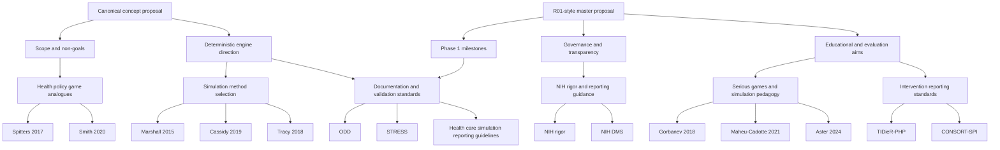
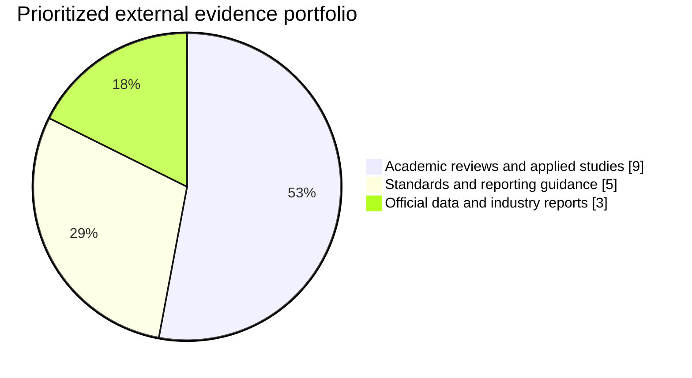
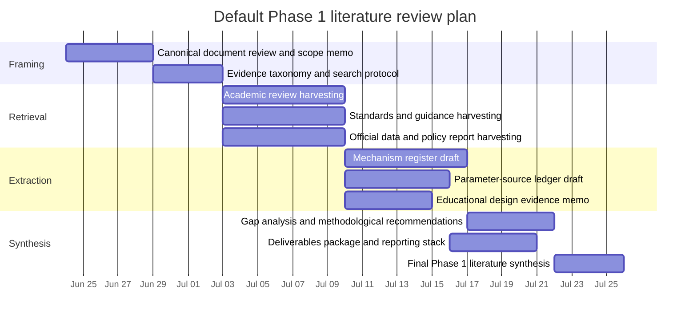

# Phase 1 Literature Research Framework for STRATA-Health

## Executive Summary

Based on the project materials that were actually retrievable in the accessible workspace, I could verify **two unique canonical starting documents** for the project: an initial game development proposal and a more expansive NIH R01-style master proposal, with markdown and docx variants of the latter. Together, these documents define a project focused on a **deterministic, replayable, Rust-based strategic simulation game** for U.S. health policy and health-system strategy education, with Phase 1 centered on ontology, engine architecture, minimal vertical slice, expert review, and validation for determinism, invariants, explainability, plausibility, and performance. They are strong on conceptual direction, scope control, and governance, but they do **not yet provide a verified empirical mechanism register, source-by-source parameter inventory, scenario data schema, or a completed literature map**. That missing evidence infrastructure is the main Phase 1 research gap. fileciteturn2file0 fileciteturn2file1

The external literature most relevant to Phase 1 supports several of the project’s core bets, but with important caveats. First, the health-professions education literature consistently suggests that serious games and simulation can improve engagement and some learning outcomes, but they do **not** automatically outperform strong comparators; effects are heterogeneous and depend heavily on alignment among objectives, mechanics, feedback, facilitation, and debriefing. Second, the health-systems and public-health modeling literature strongly supports using dynamic simulation when the problem involves feedback, adaptation, multiple actors, and policy interactions, but it repeatedly warns that **method selection must match the decision question**, and that transparent documentation and validation are non-negotiable. Third, the literature specifically on **health policy games** exists, but it is much thinner than the general medical-education and simulation literature. That means STRATA-Health has real novelty potential, but also faces a higher burden of literature-grounded design and sharper documentation of assumptions. citeturn0search0turn6search5turn0search1turn3search1turn0search5turn8search0turn18search3turn18search2

For Phase 1, the literature points to a practical conclusion: the project should not begin by trying to “prove” the entire game. It should instead produce a **traceable evidence spine** for the first vertical slice. That spine should include: a mechanism inventory linked to literature and official data; a typed ontology for actors, incentives, authorities, information, and events; a transparent documentation standard for model structure and experiments; a validation plan spanning invariants, replay, expert review, and face validity; and a pedagogical design brief specifying outcomes, feedback, and debriefing structure. The most useful standards here are ODD and STRESS for simulation documentation, health care simulation reporting guidance, INACSL standards for educational simulation quality, NIH rigor and DMS guidance for a grant-facing research program, and TIDieR-PHP plus CONSORT-SPI for later evaluation-stage intervention reporting. citeturn5view6turn21search0turn22search0turn19view3turn19view4turn19view5turn20search3turn19view6

A practical default for an unspecified Phase 1 timeline is an **eight-week literature-to-specification cycle**. The most efficient division of labor is role-based rather than title-based: one lead for domain evidence, one for modeling methods and validation, one for educational/game design evidence, one for official data/report collection, and one for synthesis and source-governance. If the team is smaller, these roles can be combined; if larger, they can be parallelized. The key deliverables should be an evidence matrix, mechanism register, parameter-source ledger, ontology draft, vertical-slice literature brief, and a validation/reporting protocol. Those deliverables are the highest-leverage way to convert the current canonical vision into a literature-grounded Phase 1 package. fileciteturn2file1 citeturn19view4turn19view5turn21search0turn22search0turn19view3

## Accessible Canonical Documents

I could verify only the documents available through the accessible project file space; no separate repository connector exposing additional internal project knowledge was available in this session. Within that accessible scope, I found **two unique project-canonical documents**, one of which appears in duplicate format variants. fileciteturn2file0 fileciteturn2file1

### Canonical document inventory

| Document | Purpose | Scope | Date | Authors | Key claims | Data sources visible now | Limitations |
|---|---|---|---|---|---|---|---|
| **Health Policy Strategy Game: Initial Game Development Proposal** fileciteturn2file0 | Establish the initial concept, design principles, first-version scope, non-goals, risks, and technical direction | U.S. health policy and regional health-system strategy; CLI-first; Rust; narrow vertical slice before generalization | File created **2026-06-23** in accessible workspace metadata. fileciteturn1file0 | **Not explicitly named** in the accessible content | Health-policy outcomes should be modeled as strategic, political, economic, and organizational interactions; engine should be deterministic, replayable, transparent, and educationally inspectable; first version should stay narrow and avoid global equilibrium or comprehensive realism. fileciteturn2file0 | Mostly conceptual at this stage: categories of actors, policy domains, and potential mechanisms are specified, but no verified empirical parameter catalog is attached. fileciteturn2file0 | Conceptually rich but pre-specification: no explicit literature review, no formal evidence table, no named authors, no finalized ontology/schema, and no source-by-source mechanism documentation. fileciteturn2file0 |
| **STRATA-Health: R01-Style Research Project Proposal** with markdown/docx variants fileciteturn2file1 | Serve as a master proposal in NIH R01 style, framing significance, innovation, aims, methods, milestones, governance, and dissemination | Five-year mixed-methods research program covering engine, game design, and later evaluation; Phase 1 “Foundation” targets ontology, engine, minimal vertical slice, and expert review | File variants created **2026-06-23** in accessible workspace metadata. fileciteturn1file2 fileciteturn1file1 | **Explicitly incomplete / placeholder-led**: PI, institution, investigators, environment, and budget fields remain to be customized. fileciteturn2file1 | The engine should be deterministic and auditable; uncertainty should be explicit; actors should have local game-theoretic behavior; entertainment should be treated as a mechanism of learning rather than decoration; model governance must separate descriptive assumptions from normative scoring; Phase 1 success is defined by replay, invariants, plausible causal pathways, explainability, and performance. fileciteturn2file1 | More explicit than the initial proposal: it references future mechanism-level empirical sourcing, comparison against public historical ranges, later research datasets, and open software/data products, but it does **not** yet enumerate verified Phase 1 empirical sources by mechanism. fileciteturn2file1 | Draft status is explicit; key institutional fields are placeholders; NOFO alignment is unresolved; supporting preliminary data are not populated; the reference list is partial and itself says relevant empirical sources will be added during model specification. fileciteturn2file1 fileciteturn1file5 |

### What the canonical documents already settle

The canonical documents already settle several foundational Phase 1 decisions. They establish that the project is not trying to model the entire U.S. healthcare system, not trying to forecast policy outcomes authoritatively, not trying to build a graphical client first, and not trying to solve a universal equilibrium every turn. They also establish that the preferred architecture is a typed deterministic state-transition core, surrounded by explicit stochastic inputs, actor-specific information models, local strategic modules, and inspectable attribution. fileciteturn2file0 fileciteturn2file1

Just as important, the master proposal defines concrete Phase 1 milestones: deterministic replay concordance, no unresolved critical invariant violations across large-scale generated turns, expert plausibility review, explainability via attributable logged effects, and acceptable runtime performance on a reference machine. These are unusually useful milestones for literature research because they tell us exactly what evidence categories Phase 1 must support: modeling method choice, documentation standards, validation practice, educational simulation design, and official domain data for scenario grounding. fileciteturn2file1

### What the canonical documents do not yet verify

The project materials do **not yet verify** at least six things that a rigorous Phase 1 literature review should now address:

1. A mechanism-by-mechanism evidence map tying each modeled relationship to primary or official sources.
2. A vetted list of official U.S. domain datasets for payer mix, hospital finance, workforce, access, and policy baselines.
3. A chosen reporting standard stack for the engine, scenario files, and later empirical evaluations.
4. A documented rationale for which simulation methods belong in the deterministic core versus local strategic modules.
5. A literature-backed approach to debriefing, facilitation, end-user co-design, and learning measurement.
6. A traceable plan for how future Phase 2/3 evaluation reporting will satisfy intervention and trial-reporting expectations. fileciteturn2file0 fileciteturn2file1

### Evidence relationship map

## Search Strategy and Evidence Base

Because the project domain was initially unspecified by the user, I first inferred it strictly from the accessible canonical documents: **a deterministic, strategic, health-policy simulation game for graduate and executive education, grounded in health systems, policy, game-based learning, and transparent simulation science**. The external search then prioritized four evidence clusters: educational efficacy of serious games and simulation; health-systems and public-health dynamic modeling methods; simulation/reporting standards and grant-facing guidance; and official U.S. health-system data sources for scenario grounding. fileciteturn2file0 fileciteturn2file1

Searches were run across primary and official sources where possible: PubMed and PubMed Central discovery pages for peer-reviewed literature, Springer open-access article pages, EQUATOR reporting-guideline records, NIH Grants and HHS pages, INACSL, CoMSES, CMS, MedPAC, MACPAC, KFF, and BLS. English-language sources were prioritized. When full text was not easily accessible through the search environment, I used official abstract pages or publisher metadata and explicitly treat those entries with slightly lower confidence than open full-text or official standards pages. citeturn19view4turn19view5turn19view3turn5view6turn20search3turn19view6turn19view8turn19view9turn19view10

### Search databases and representative queries

| Database or site | Why it was searched | Representative queries actually used |
|---|---|---|
| File-library project documents | Identify canonical project materials | `+(Health Policy Strategy Game) OR +(STRATA Health)`, `canonical project proposal`, `R01-style project proposal` |
| PubMed / PMC discovery | Academic reviews, seminal papers, applied studies | `serious games healthcare professions education systematic review meta-analysis`, `game-based learning medical education review`, `agent-based modeling public health`, `health policy simulation education game`, `selecting a dynamic simulation modeling method for health care delivery research` |
| EQUATOR Network | Reporting standards for intervention and simulation studies | `TIDieR-PHP`, `CONSORT-SPI`, `STRESS guidelines`, `reporting guidelines health care simulation research` |
| NIH Grants & Funding | Rigor, reproducibility, DMS, human-subjects / clinical-trial classification | `rigor and reproducibility grant applications NIH guidance`, `Data Management and Sharing policy overview NIH`, `NIH definition of a clinical trial` |
| INACSL / SSH / AHRQ | Educational simulation quality, facilitation, debriefing | `Healthcare Simulation Standards of Best Practice`, `debriefing clinical learning`, `simulation research tools SSH` |
| CMS / MedPAC / MACPAC / KFF / BLS | Scenario-grounding data for Phase 1 domain literature | `National Health Expenditure Data official`, `Employer Health Benefits Survey 2025`, `MedPAC March 2025`, `MACStats 2026`, `BLS healthcare occupations` |
| Technical engineering sources | Deterministic replay / simulation engineering patterns | `deterministic lockstep`, `floating point determinism` |

### Prioritization logic

Sources were ranked highest when they met most of five conditions: direct relevance to Phase 1 tasks, primary or official provenance, methodological rigor, explicit applicability to simulation or intervention reporting, and usefulness for producing a vertical-slice evidence spine. Under that logic, systematic reviews and official standards outranked opinion pieces, and official data repositories outranked secondary commentary. Commentary and technical blogs were kept only where they addressed implementation problems not covered well by academic or official sources. citeturn0search0turn6search5turn21search0turn19view3turn19view4turn19view5turn19view8

### Distribution of the prioritized external corpus

The resulting evidence portfolio is intentionally unbalanced: it leans toward **academic reviews and standards** because the main Phase 1 risk is not lack of domain facts alone, but lack of a defensible methodological and documentation framework. That aligns with the canonical documents, which are already conceptually rich but still need an evidence-governed way to connect mechanisms, assumptions, and validation procedures. fileciteturn2file1 citeturn21search0turn22search0turn19view3turn19view4

## Prioritized External Sources

### Pedagogy and policy-game evidence

| Source | Methodology and datasets | Key findings | Limitations | Relevance to Phase 1 | Confidence |
|---|---|---|---|---|---|
| **Maheu-Cadotte et al., 2021, serious games efficacy meta-analysis** citeturn0search0turn17search0 | Systematic review and meta-analysis of experimental studies in health-professions education | Supports serious games as promising for engagement and learning, but as a synthesized evidence base rather than a universal endorsement | Full extraction details were not all accessible in-session; heterogeneity likely high | Strong anchor for whether the project’s educational-game premise is evidence-supported | High |
| **Gorbanev et al., 2018, serious games in medical education** citeturn6search5turn15search12 | Systematic review of serious games in medical education; quality/pedagogical strategy focus | Evidence landscape is optimistic but only moderate in quality; pedagogical strategy matters as much as the game label | Domain is medical education broadly, not health policy specifically | Useful caution against assuming “game = better learning” | High |
| **Xu et al., 2023, game-based learning in medical education** citeturn0search1turn7search30 | Narrative review of recent studies, including serious games, gamification, and simulation-based education | Reinforces that GBL and SBE can support active, safer practice environments when aligned with objectives | Broad review; not Phase-1-specific; likely mixes varied interventions | Good bridge between serious games and wider simulation pedagogy | Medium |
| **Aster et al., 2024, design elements review** citeturn15search2turn15search14 | Mixed-methods systematic review of serious-game design elements, underlying theories, and teaching effectiveness | Design choices and theory matter; effectiveness is not just about content domain but about mechanics, feedback, and instructional theory | Search-environment access limited to abstract-level metadata | Directly relevant to Phase 1 game-loop and feedback design decisions | High |
| **Maheu-Cadotte et al., 2021, end-user involvement review** citeturn16search1turn16search2turn19view2turn16search16 | Systematic descriptive review of end-user involvement during serious-game development | The review explicitly notes lack of a dedicated evidence base or framework for involving end users; a later commentary reports that among 45 efficacy-tested games, only 21 reported end-user involvement | Focuses on reporting patterns, not causal proof of better outcomes from co-design | Strong justification for formalized participatory design in Phase 1, instead of ad hoc expert consultation | High |
| **Spitters et al., 2017, policy game for public-health policymaking** citeturn18search0turn18search3turn19view0 | Open-access research article on developing a policy-game intervention to enhance collaboration in public-health policymaking in three European countries | Provides a direct policy-game analogue showing that collaboration-focused policy games can be designed and studied in public-health contexts | Public-health policymaking, not health-system executive strategy; European context | Valuable nearest-neighbor analogue for multi-actor health-policy game design | High |
| **Smith et al., 2020, infectious-disease outbreak matrix game** citeturn13search4turn18search2turn19view1 | Commentary/open-access reflection on using a matrix game for infectious-disease crisis policy learning | Argues that serious games can help policy-makers and practitioners experience cooperation challenges, bias, and implementation difficulty | Commentary rather than controlled evaluation | Useful as an analogue for uncertainty, negotiation, and policy feedback in game design | Medium |
| **Godinho et al., 2020, global digital health policymaking** citeturn13search0turn18search1turn18search4 | Perspective/commentary on debate-based serious games for global digital health policymaking | Supports the idea that policymaking simulations can be used to surface framing, tradeoffs, and stakeholder dynamics | Not an intervention trial; limited empirical outcome detail | Helpful for the project’s “policy is strategically mediated” thesis | Medium |

### Modeling, validation, and standards evidence

| Source | Methodology and datasets | Key findings | Limitations | Relevance to Phase 1 | Confidence |
|---|---|---|---|---|---|
| **Marshall et al., 2015, selecting a dynamic simulation method** citeturn3search1turn3search3 | Methodological overview of system dynamics, discrete-event simulation, agent-based modeling, and hybrid choices for health care delivery research | Method should be chosen by problem structure and decision question, not by researcher preference; multiple dynamic methods can be appropriate for health-system problems | Overview paper, not a project-specific recipe | Central for deciding what belongs in STRATA-Health’s deterministic core versus local strategic modules | High |
| **Cassidy et al., 2019, mathematical modelling for health systems research** citeturn0search5 | Review of modeling approaches in health-systems research | Frames system dynamics and agent-based models as complementary for macro- and micro-level health-system questions | Broad rather than implementation-specific | Strong support for a hybrid view of institutions plus local actors | High |
| **Tracy et al., 2018, agent-based modeling in public health** citeturn0search2turn8search0turn8search5 | Review of ABM applications in public health | ABM is increasingly useful for complex dynamic systems involving interacting actors and environments | Public health is broader than health-system executive strategy | Supports actor-based modeling where policy outcomes emerge from interactions, not direct levers | High |
| **Kopec et al., 2010, validation of population-based disease simulation models** citeturn8search7 | Review of validation principles and methods for simulation models | Validation should be multi-pronged; no single validation test is sufficient | Focuses on disease simulation rather than educational strategy games | Very relevant to the project’s planned combination of property tests, replay, expert review, and plausibility checks | High |
| **Squires et al., 2023, modeling behavior in health-economics simulation** citeturn0search16turn8search2 | Cross-disciplinary review of methods for incorporating behavior into simulation models | Behavioral incorporation remains methodologically heterogeneous and requires explicit choices, not implicit defaults | More health-economics focused than game-based learning | Important for actor utilities, bounded rationality, and institutional behavior modules | Medium |
| **ODD protocol, 2010 first update and 2020 second update** citeturn5view6turn4search8turn4search12 | Documentation protocol for ABMs and other simulation models; updated for clarity, replication, and structural realism | ODD exists to make complex models more understandable, complete, and less vulnerable to irreproducibility critiques | Documentation standard, not an efficacy or design guide | Excellent candidate for STRATA-Health’s model-description and scenario-documentation backbone | High |
| **STRESS guidelines, 2018** citeturn21search0 | Reporting guideline suite for DES, SD, and ABM in operational research and management science | Provides dedicated checklists for empirical simulation studies, including ABM, DES, and SD | Reporting guidance, not substantive domain evidence | Useful for turning internal experiments and prototype evaluations into auditable reports | High |
| **Reporting Guidelines for Health Care Simulation Research, 2016** citeturn22search0 | Extensions to CONSORT and STROBE tailored to health care simulation research | Recognizes that simulation studies need adapted reporting expectations | Closer to healthcare simulation research than to policy-game engine design | Important for Phase 2/3 but worth incorporating early so Phase 1 prototypes are documented in the right structure | High |
| **INACSL Healthcare Simulation Standards of Best Practice** citeturn19view3turn2search2 | Official standards set covering design, outcomes/objectives, facilitation, debriefing, operations, evaluation, and interprofessional education | Emphasizes rigorous, evidence-based simulation practices and reinforces the importance of objectives, facilitation, and debriefing | Developed for healthcare simulation broadly, not specifically digital strategy games | Strong educational quality framework for the project’s playtesting, facilitation, and debriefing design | High |

### Official guidance and scenario-grounding sources

| Source | Methodology and datasets | Key findings | Limitations | Relevance to Phase 1 | Confidence |
|---|---|---|---|---|---|
| **NIH Rigor and Reproducibility guidance** citeturn19view4turn1search8 | Official NIH grant-application guidance | NIH explicitly expects rigor, transparency, and reproducibility to be addressed in applications and reviews | Not domain-specific to games | Directly relevant because the canonical project is framed as an NIH-style research program | High |
| **NIH Data Management and Sharing policy** citeturn19view5turn1search13 | Official NIH data-sharing policy and implementation guidance | NIH’s DMS policy is active and expects planning for sharing scientific data to support validation and reuse | Data-sharing guidance, not simulation design guidance | Important because the project expects code, scenarios, telemetry, and research outputs to become shareable products | High |
| **TIDieR-PHP** citeturn20search3turn20search1 | Reporting guideline for public health, health-systems, and policy interventions | Tailored to reporting population health and policy interventions, including exposure, enforcement, and legislation | Reporting-oriented rather than design-oriented | Highly relevant if STRATA-Health’s scenarios are later described as policy interventions or policy-learning interventions | High |
| **CONSORT-SPI 2018** citeturn19view6turn11search7 | CONSORT extension for randomized trials of social and psychological interventions | Extends standard RCT reporting for complex social/behavioral interventions | More relevant to later evaluation than to engine development | Important because the project’s planned educational trial fits the broader class of social and psychological interventions | High |
| **CMS National Health Expenditure Data** citeturn19view8turn12search4turn12search8 | Official U.S. expenditure series and projections by service type and funding source | Provides historical and projected health spending by hospital care, physician services, drugs, and payer sources; CMS reports U.S. health spending reached $5.3 trillion in 2024, with private insurance, Medicare, and Medicaid major funding sources | Macro-level, not scenario-ready institution-level data | Essential backbone source for high-level scenario grounding and plausibility ranges | High |
| **KFF 2025 Employer Health Benefits Survey** citeturn19view10turn12search15 | Annual employer survey of health benefits, premiums, employee contributions, and cost sharing | KFF reports that employer-sponsored insurance covers 154 million people under age 65 and continues to track premium, contribution, and plan-design trends; the 2025 survey reports average single and family premiums of $9,325 and $26,993. | Employer-sponsored market only; methodology changed in 2025 to firms with 10+ employees, affecting some trend comparability. citeturn12search19 | Useful for scenario assumptions about employers, commercial insurance pressures, and affordability tradeoffs | High |
| **MedPAC March 2025 report** citeturn19view9turn12search1 | Official Medicare Payment Policy report to Congress | Covers inpatient and outpatient hospital services and other FFS payment systems, making it a key source for Medicare payment mechanics | Medicare-focused and policy-facing, not game-design-focused | Strong source for modeling Medicare payment constraints in the first U.S. scenario | High |
| **BLS healthcare occupation outlook** citeturn23search0turn23search3turn23search4 | Official employment projections and labor-market reporting | BLS projects healthcare occupations to grow faster than average, with about 1.9 million openings annually on average, and reports sector employment growth from March 2025 to March 2026 | Macro labor-market data, not institution-specific turnover microdata | Good official anchor for workforce-pressure scenario assumptions | High |

### Technical blogs and engineering references

These are **not primary scientific evidence** for educational effectiveness, but they are useful implementation references for the project’s deterministic-engine ambitions. Gaffer on Games’ explanation of deterministic lockstep captures the core systems idea: send inputs instead of state, making bandwidth proportional to inputs rather than object count. The same blog series also warns that deterministic approaches become fragile when cross-platform determinism and latency handling are poor, and that floating-point determinism requires tightly controlled instructions, compilers, and platform assumptions. Those are exactly the sorts of engineering caveats the canonical documents should acknowledge in a Phase 1 technical risk register. citeturn19view11turn9search11turn9search9

## Phase 1 Literature Synthesis

### What the literature supports

The project’s central educational idea is plausible. Multiple reviews support simulation and serious games as promising vehicles for active learning, deliberate practice, and engagement in health-professions education. But the literature consistently refuses the simplistic conclusion that “adding a game” is enough. The strongest reading is narrower: serious games appear most defensible when they have explicit objectives, meaningful feedback, coherent mechanics, and structured reflection or debriefing. That fits the canonical project documents well, because they already reject superficial gamification and explicitly foreground agency, readable complexity, causal explanation, and instructor-facing analysis. citeturn0search0turn6search5turn0search1turn15search2turn19view3 fileciteturn2file1

The project’s modeling idea is also plausible. The literature on health-systems and public-health simulation repeatedly points to the value of dynamic simulation when problems involve interacting actors, feedback loops, nonlinearity, behavior change, and policy adaptation. The canonical plan to combine a deterministic transition core with localized strategic interactions is therefore directionally supported. What the literature does **not** support is choosing ABM, SD, DES, bargaining models, or heuristics on taste alone. Method choice needs to be question-led and documented. In practice, that means Phase 1 should explicitly map each first-slice mechanism to a modeling family: deterministic accounting core, information model, bargaining submodel, coalition logic, or exogenous shock process. citeturn3search1turn0search5turn8search0turn8search2turn8search7

The project’s transparency ambitions are especially well supported. ODD, STRESS, health care simulation reporting guidance, CONORT-SPI, TIDieR-PHP, and NIH rigor/DMS guidance collectively imply a strong norm: **if the project wants to function as both educational software and research instrument, it needs documentation and reporting structure from the beginning, not after the fact**. This is one of the clearest implications of the literature review. The canonical proposal already moves in this direction by requiring provenance, uncertainty notes, versioned decision records, and no high-impact outcomes without causal attribution. The literature supports making those requirements formal and standardized. citeturn5view6turn21search0turn22search0turn19view6turn20search3turn19view4turn19view5 fileciteturn2file1

### What remains weakly evidenced

The weakest part of the external evidence base is not simulation generally, but **health-policy strategy games specifically**. Direct analogues exist, but they are comparatively sparse and often qualitative, design-oriented, or commentary-based rather than mature controlled evaluations. That means STRATA-Health will have to draw from adjacent literatures: health-professions serious games, simulation pedagogy, public-health policy games, and health-systems modeling. This is not a flaw, but it raises the burden on Phase 1 to document why each borrowed design choice is appropriate for the project’s distinctive domain. citeturn18search3turn18search2turn18search1turn0search0turn6search5

A second weak area is the evidence base for **entertainment as a mechanism** rather than a side effect. The canonical proposal is unusually explicit that entertainment should mediate learning and persistence. That is a thoughtful hypothesis, but the accessible literature more strongly supports alignment, engagement, and active learning than it does a finely specified causal chain from suspense or narrative consequence to transfer. Phase 1 should therefore treat “entertainment mechanisms” as a hypothesis to operationalize and test, not as a settled claim. fileciteturn2file1 citeturn0search0turn15search2turn19view3

A third weak area is empirical grounding for the first vertical slice. The canonical documents define the policy domains, but they do not yet provide the literature-backed quantitative or qualitative baselines needed for payer bargaining, workforce stress, market structure, or state-policy shifts. Official sources such as CMS, KFF, MedPAC, MACPAC, and BLS can supply the outer envelope, but Phase 1 still needs a scenario-specific evidence selection procedure so the game does not drift into false precision. fileciteturn2file0 fileciteturn2file1 citeturn19view8turn19view9turn19view10turn12search18turn23search0

### Gaps and open questions

The most important open questions for Phase 1 are these:

| Open question | Why it matters | Literature implication |
|---|---|---|
| Which mechanisms belong in the deterministic core, and which belong in local strategic modules? | Prevents over-engineering and method mismatch | Use Marshall/Cassidy/Tracy as method-selection anchors, not generic ABM enthusiasm. citeturn3search1turn0search5turn8search0 |
| What documentation standard will govern model descriptions, scenario files, and simulation experiments? | Necessary for reproducibility, explainability, and future grant/trial reporting | Adopt ODD + STRESS + health care simulation reporting guidance as a combined stack. citeturn5view6turn21search0turn22search0 |
| How will end users be involved, and at what decision points? | Literature shows co-design is often underreported and understructured | Formalize participatory design in the Phase 1 workflow. citeturn19view2turn16search16 |
| How will “educational rigor” and “entertainment” be operationalized before playtesting? | Avoids vague success criteria | Use explicit objectives, facilitation, debriefing, and game-design constructs from Aster and INACSL. citeturn15search2turn19view3 |
| Which official data sources define plausible ranges for payer, workforce, finance, and access mechanisms? | Prevents false realism and unsupported parameters | Build a parameter ledger from CMS, KFF, MedPAC, MACPAC, and BLS. citeturn19view8turn19view9turn19view10turn12search18turn23search0 |
| How will later trial reporting be anticipated now? | Reduces redesign later | Use TIDieR-PHP and CONSORT-SPI as future-proofing constraints. citeturn20search3turn19view6 |

### Recommended readings

For an efficient Phase 1 reading stack, I would prioritize the following order:

| Tier | Source | Why it should be read early |
|---|---|---|
| Core | STRATA-Health master proposal fileciteturn2file1 | Defines actual Phase 1 milestones and project constraints |
| Core | Health Policy Strategy Game proposal fileciteturn2file0 | Defines non-goals, vertical-slice philosophy, and engine direction |
| Core | Marshall 2015 citeturn3search1turn3search3 | Best starting point for simulation-method selection |
| Core | ODD 2010/2020 citeturn5view6turn4search8 | Best starting point for model-description discipline |
| Core | STRESS 2018 citeturn21search0 | Best starting point for simulation experiment reporting |
| Core | Maheu-Cadotte 2021 efficacy review citeturn0search0 | Strongest direct support for the serious-game premise |
| Core | Aster 2024 citeturn15search2 | Best design-focused evidence for game mechanics and instructional theory |
| Core | INACSL standards citeturn19view3 | Best educational simulation quality framework |
| Core | NIH rigor + DMS pages citeturn19view4turn19view5 | Essential if the project stays grant-facing |
| Supporting | Spitters 2017 citeturn18search3 | Closest public-health policy-game analogue |
| Supporting | Tracy 2018 / Cassidy 2019 citeturn8search0turn0search5 | Best support for multi-actor systems modeling |
| Supporting | CMS NHE + KFF 2025 survey citeturn19view8turn19view10 | Best official starting points for scenario plausibility ranges |

### Implications for Phase 1 methods and deliverables

The first implication is that Phase 1 should produce an **evidence-linked mechanism register**. Every mechanism in the vertical slice should have a row containing: mechanism name, canonical rationale, modeling family, empirical basis, official data source if applicable, uncertainty notes, normative sensitivity, proposed validation checks, and document owner. That recommendation follows directly from the canonical governance goals and the external standards literature on replication and reporting. fileciteturn2file1 citeturn5view6turn21search0turn19view4

The second implication is that Phase 1 should produce a **typed ontology and scenario boundary memo** before coding broad content. The canonical documents already imply this, but the literature sharpens it: a narrow vertical slice should be driven by explicit questions and bounds, not vague “representativeness.” That means listing what the slice includes, excludes, approximates, defers, and treats as exogenous. fileciteturn2file0 fileciteturn2file1 citeturn3search1turn0search5

The third implication is that the project should maintain a **parameter-source ledger** built from official sources first and academic literature second. For U.S. spending and payer structure, begin with CMS NHE; for employer-sponsored insurance, KFF; for Medicare payment constraints, MedPAC; for Medicaid policy structure and enrollment context, MACPAC; and for workforce trends, BLS. This does not replace focused academic literature, but it prevents unsourced macro assumptions. citeturn19view8turn19view9turn19view10turn12search18turn23search0

The fourth implication is that the project should define a **playtest evidence protocol** in Phase 1, not Phase 2. The serious-games and simulation literature suggests that objectives, feedback, facilitation, and debriefing design materially shape outcomes. So even the earliest vertical slice should specify what is being tested: engagement, comprehensibility of actor behavior, usefulness of true-state vs observed-state distinction, explainability, and decision quality under uncertainty. That mirrors the canonical proposal’s own vertical-slice logic and aligns with INACSL and serious-game design reviews. fileciteturn2file0 fileciteturn2file1 citeturn19view3turn15search2turn0search0

## Comparative Tables and Proposed Timeline

### Comparative matrix of canonical and external sources

| Source | Date | Type | Credibility | Methods | Datasets | Relevance to Phase 1 | Confidence |
|---|---:|---|---|---|---|---|---|
| Health Policy Strategy Game proposal fileciteturn2file0 | 2026 | Canonical concept doc | High for internal intent; low for empirical grounding | Conceptual design specification | None enumerated formally | Defines scope, non-goals, architecture direction | High |
| STRATA-Health R01-style proposal fileciteturn2file1 | 2026 | Canonical master proposal | High for internal intent; medium for execution detail | Grant-style aims/methods/governance framing | Future sources implied, not enumerated mechanism-by-mechanism | Defines Phase 1 milestones and governance | High |
| Maheu-Cadotte 2021 efficacy review citeturn0search0 | 2021 | Systematic review/meta-analysis | High | Experimental-study synthesis | Included health-professions serious-game studies | Educational premise, effect heterogeneity | High |
| Gorbanev 2018 citeturn6search5turn15search12 | 2018 | Systematic review | High | Review of serious games in medical education | Included medical-education game studies | Pedagogy quality and evidence caution | High |
| Aster 2024 citeturn15search2 | 2024 | Mixed-methods systematic review | High | Review of design elements and teaching effectiveness | Included medical/healthcare serious games | Mechanics, theory, feedback design | High |
| Maheu-Cadotte 2021 end-user review citeturn19view2turn16search16 | 2021 | Systematic descriptive review | High | Review of development-process reporting | Published serious-game development studies | Participatory design workflow | High |
| Spitters 2017 citeturn18search3turn19view0 | 2017 | Applied policy-game study | High | Intervention development in public-health policymaking | Three-country policy-game context | Closest health-policy analogue | High |
| Marshall 2015 citeturn3search1turn3search3 | 2015 | Methodological overview | High | Dynamic simulation method selection | Health care delivery examples | Core modeling-method decision support | High |
| Tracy 2018 citeturn8search0turn8search5 | 2018 | Review | High | ABM review in public health | ABM application literature | Multi-actor emergence and policy interaction | High |
| Kopec 2010 citeturn8search7 | 2010 | Validation review | High | Validation principles for simulation | Population disease-simulation studies | Validation protocol design | High |
| ODD 2010/2020 citeturn5view6turn4search8 | 2010 / 2020 | Documentation standard | High | Structured ABM/model description protocol | Not data-driven; reporting standard | Model-description backbone | High |
| STRESS 2018 citeturn21search0 | 2018 | Reporting guideline | High | Checklists for DES/SD/ABM reporting | Not data-driven; reporting standard | Simulation experiment reporting | High |
| INACSL standards citeturn19view3 | 2021 / 2025 updates | Professional standards | High | Evidence-based simulation standards | Not dataset-focused | Outcomes, facilitation, debriefing, evaluation | High |
| NIH rigor guidance citeturn19view4 | 2024 page update | Official grant guidance | High | Application/review expectations | Not dataset-focused | Grant-facing research rigor | High |
| NIH DMS policy citeturn19view5 | 2023 policy; 2026 page update | Official policy | High | Data-sharing policy and plan guidance | Scientific data broadly | Phase 1 governance and artifact planning | High |
| TIDieR-PHP citeturn20search3 | 2018 | Reporting guideline | High | Policy/public-health intervention reporting | Not dataset-focused | Intervention/spec reporting | High |
| CONSORT-SPI citeturn19view6 | 2018 | Trial reporting extension | High | RCT reporting guidance for social/psych interventions | Not dataset-focused | Future evaluation design/reporting | High |
| CMS NHE data citeturn19view8turn12search8 | 2025–2026 pages | Official data/report | High | National expenditure accounts and projections | U.S. spending by service and payer | Scenario plausibility ranges | High |
| KFF 2025 EHBS citeturn19view10turn12search15 | 2025 | Industry/official survey report | High | Employer survey | Employer-sponsored benefit data | Commercial insurance and affordability context | High |
| MedPAC March 2025 citeturn19view9 | 2025 | Official policy report | High | Congressional policy analysis | Medicare payment-system analyses | Medicare mechanics in first scenario | High |
| Gaffer deterministic lockstep citeturn19view11turn9search9 | 2010 / 2014 | Technical blog | Medium | Engineering exposition | None | Deterministic replay and cross-platform risks | Medium |

### Proposed Phase 1 literature-review timeline

Because no project timeline was specified, the most defensible default is a compact eight-week research sprint that can be compressed or expanded.

### Proposed responsibilities

| Role | Primary responsibilities | Inputs | Outputs |
|---|---|---|---|
| Domain evidence lead | Health policy, health-system, payer, workforce, and market literature | Canonical scope, official reports, health-policy analogues | Mechanism shortlist, policy/source memo |
| Simulation methods lead | Modeling-family selection, validation, documentation standards | Marshall, Cassidy, Tracy, Kopec, ODD, STRESS | Method-selection memo, validation framework |
| Educational design lead | Serious games, simulation pedagogy, co-design, debriefing literature | Maheu-Cadotte, Gorbanev, Aster, INACSL | Learning-design brief, playtest criteria |
| Data and reports lead | Official U.S. data/report collection and source provenance | CMS, KFF, MedPAC, MACPAC, BLS | Parameter-source ledger, data inventory |
| Synthesis lead | Integrate evidence into project-writeup and decision records | All prior workstreams | Executive synthesis, gap register, recommended readings |
| Project owner or scientific lead | Final arbitration on scope, evidence sufficiency, and modeling boundaries | All interim memos | Approved Phase 1 evidence spine |

If the team is only two or three people, the simulation-methods lead and synthesis lead can be combined, and the domain evidence lead can also own official data/report collection. If the team is larger, the highest-value parallelization is between pedagogy, modeling, and official-data workstreams. Those three workstreams are interdependent but not sequential. This recommendation is an inference from the project’s own architecture and governance needs, not a claim from a single external source. fileciteturn2file1

### Phase 1 deliverables that the literature most strongly justifies

| Deliverable | Why it is needed |
|---|---|
| Evidence-linked mechanism register | Prevents unsupported causal mechanisms and false precision |
| Typed ontology and scenario boundary memo | Keeps the vertical slice narrow and legible |
| Parameter-source ledger | Makes payer, workforce, finance, and policy assumptions auditable |
| Documentation stack decision | ODD + STRESS + health care simulation reporting guidance |
| Educational design brief | Links objectives, mechanics, feedback, facilitation, and debriefing |
| Playtest evidence protocol | Ensures early prototypes are evaluable, not just demo-able |
| Governance and provenance template | Aligns with NIH rigor, DMS, and canonical transparency commitments |
| Phase 1 synthesis memo | Creates a durable handoff from literature research to specification |

### Search keywords and prioritized query set

The most productive keywords and query families for this project were:

| Theme | High-yield keywords and queries |
|---|---|
| Serious games and education | `serious games healthcare professions education systematic review`, `medical education serious games pedagogical strategy`, `game design elements serious games healthcare professions` |
| Participatory design | `end user involvement serious games health professions education`, `participatory design policy game public health` |
| Health policy games | `health policy simulation game education`, `policy game public health policymaking`, `serious games policymaking health` |
| Simulation method selection | `dynamic simulation health care delivery research`, `agent-based modeling public health review`, `mathematical modelling health systems research` |
| Validation and reporting | `validation of population-based disease simulation models`, `ODD protocol`, `STRESS simulation reporting guideline`, `health care simulation research reporting CONSORT STROBE extension` |
| Educational simulation standards | `INACSL standards outcomes objectives debriefing facilitation`, `AHRQ debriefing clinical learning` |
| Grant and policy guidance | `NIH rigor reproducibility guidance`, `NIH data management sharing policy`, `TIDieR-PHP`, `CONSORT-SPI` |
| Scenario-grounding official data | `CMS National Health Expenditure Data`, `KFF Employer Health Benefits Survey 2025`, `MedPAC March 2025 Medicare payment policy`, `BLS healthcare occupations outlook` |

## Bottom-Line Assessment

The accessible canonical documents are coherent, ambitious, and unusually well aligned with modern expectations for reproducibility, transparency, and scope discipline. Their main weakness is **not conceptual ambiguity but evidence incompleteness**: the project vision is farther along than its literature and source infrastructure. fileciteturn2file0 fileciteturn2file1

External literature gives the project a solid Phase 1 foundation if it proceeds in the right order. The evidence supports a narrow, literature-linked vertical slice; a hybrid dynamic-simulation approach chosen by question rather than fashion; a strong documentation and reporting stack; explicit participatory design; and early use of official macro sources for plausibility bounds. It does **not** support claiming that a serious game will automatically outperform strong case-based instruction, nor that entertainment mechanisms are already established for this exact setting. Those claims remain empirical questions for the project to test. citeturn0search0turn6search5turn15search2turn3search1turn0search5turn8search0turn19view3turn19view4turn19view5

Accordingly, the most rigorous Phase 1 literature objective is not “read everything about health policy games.” It is to build a **verifiable evidence spine** for the project’s first playable slice: one that ties each mechanism, parameter, educational objective, reporting standard, and validation test to a sourceable justification. That is the clearest path from the current canonical documents to a defensible Phase 1 methods package. fileciteturn2file1 citeturn5view6turn21search0turn22search0turn20search3turn19view8turn19view10